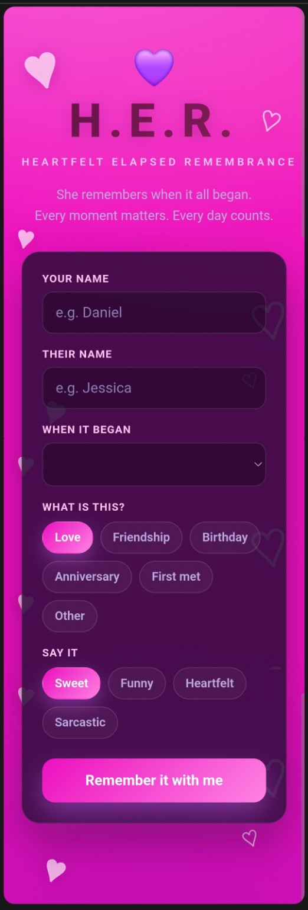
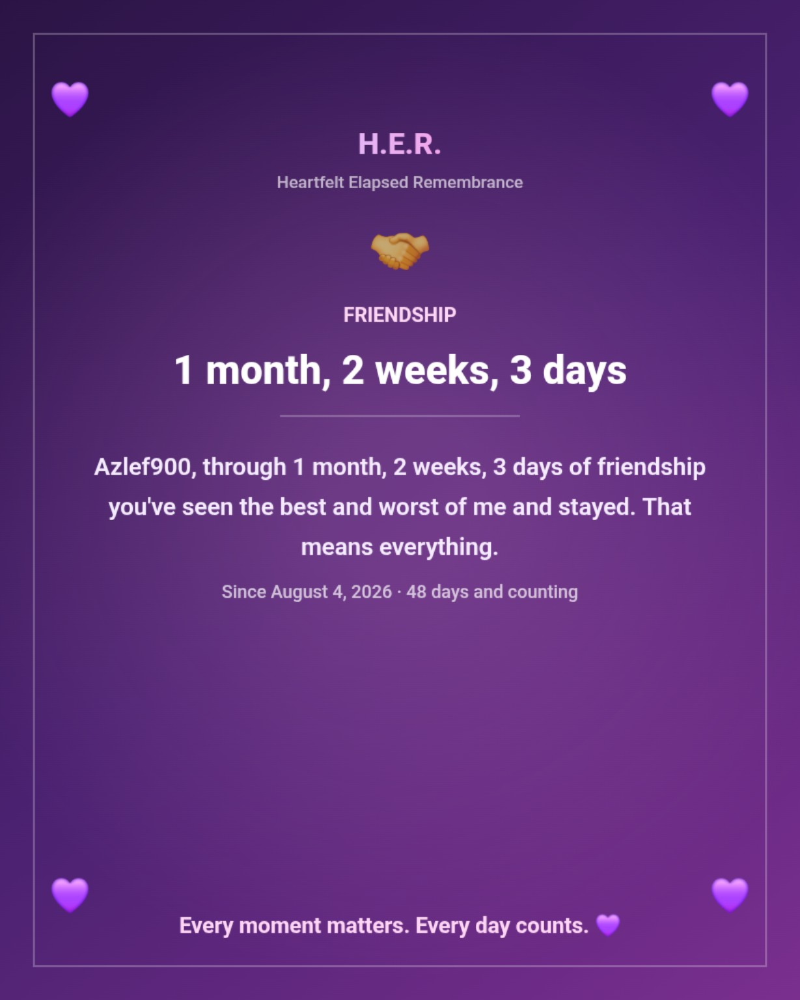

<div align="center">

# 💜 H.E.R. 💜

### H E A R T F E L T &nbsp; E L A P S E D &nbsp; R E M E M B R A N C E

**She remembers when it all began.**  
*Every moment matters. Every day counts.*



<br />


### ✨ TRACK IT · 💖 TREASURE IT · 💌 SHARE IT ✨

[Explore H.E.R.](#-what-is-her) · [How it works](#-how-it-works) · [See a keepsake](#-a-little-something-to-keep) · [FAQ](#-faq)

</div>

---

<div align="center">

## 💌 A little time. A lot of meaning.

**Some dates are too important to forget.**  
The day you met. The day you became friends. The birthday you celebrate every year. The moment everything changed.

H.E.R. turns those dates into a personal message and a keepsake worth holding onto. 💜

</div>

## 🌈 What is H.E.R.?

**H.E.R.** stands for **Heartfelt Elapsed Remembrance**. It's a personalized memory app designed to show how long it's been since a special date, in **years, months, weeks, and days**.

Choose the occasion. Pick the vibe. Make it yours. Then **save your date, share the message, or download a keepsake** featuring your memory. No frantic second-by-second timer here. **Every day counts.** 💜

| 💜 Your moment | ✨ What H.E.R. does |
|:---|:---|
| ❤️ Love | Remembers when your story began. |
| 🤝 Friendship | Celebrates the people who stuck around. |
| 🎂 Birthday | Counts your trips around the sun, with attitude if you want it. |
| 💍 Anniversary | Gives a milestone its moment. |
| 👋 First met | Remembers your very first hello. |
| 🌟 Other | Leaves room for *your* reason to remember. |

## 🎬 How it works

```text
     💜 YOUR NAME          💌 THEIR NAME
              ╲            ╱
               📅 PICK A DATE
                      ↓
            🎉 CHOOSE AN OCCASION
                      ↓
     🥰 SWEET  ·  😂 FUNNY  ·  💗 HEARTFELT  ·  😏 SARCASTIC
                      ↓
             ✨ REMEMBER IT WITH ME ✨
                      ↓
            🗓️ YOUR TIME + YOUR MESSAGE
                      ↓
         💾 SAVE  ·  🔗 SHARE  ·  🖼️ KEEPSAKE
```

**1. ✍️ Add your names.** Tell H.E.R. who's remembering and who's being remembered.  
**2. 📅 Choose when it began.** Enter the date that matters.  
**3. 💞 Pick the occasion.** Love, friendship, birthday, anniversary, first met, or other.  
**4. 🎭 Set the tone.** Sweet, funny, heartfelt, or sarcastic.  
**5. 🎁 Keep the memory.** Save the special date, share the message, or download your keepsake.

> 💡 **A note on the counter:** H.E.R. displays years, months, weeks, and days. The number of *total days* can appear alongside that breakdown on a keepsake.

## 💬 Every memory has a voice

*Examples below are illustrative. Your message and elapsed time depend on your chosen date and tone.*

| Occasion | A little H.E.R. energy |
|:---|:---|
| ❤️ **Love** | “Daniel, I've loved you for 33 years, 9 months, 2 weeks, and 2 days.” |
| 🤝 **Friendship** | “Jessica, we've been friends for 12 years, 4 months, and 6 days. And you still put up with my shit!” |
| 🎂 **Birthday** | “Congratulations! You've been stuck on this shitty planet for 53 years, 7 months, and 11 days!” |
| 💗 **Heartfelt** | “You've seen the best and worst of me and stayed. That means everything.” |
| 😏 **Sarcastic** | “I've kept you around. Mostly for the snacks. But also because I love you.” |

<div align="center">

## 🖼️ A little something to keep

*Because not every memory belongs only on a screen.*



**Your date. Your message. Your keepsake.** 💜

</div>

### 🎀 Keep it close or send it along

- 💾 **Save** a special date so you can revisit it.
- 💬 **Share** a personal message with someone who matters.
- 🖼️ **Download** a keepsake with the occasion, elapsed time, message, and date printed on it.

---

## 🎨 Made to feel like a memory

<div align="center">

`HOT PINK` 💗 `PURPLE HEARTS` 💜 `PERSONAL WORDS` 💌 `BIG FEELINGS` ✨

**Sweet when you need it. Silly when you want it. Yours every time.**

</div>

## ❓ FAQ

<details>
<summary><b>⏳ Does H.E.R. count seconds and minutes?</b></summary>
<br />
No. H.E.R. focuses on <b>years, months, weeks, and days</b>. Every day counts. 💜
</details>

<details>
<summary><b>🥳 Is it only for romantic relationships?</b></summary>
<br />
Nope! Birthdays, friendships, anniversaries, first meetings, and other special dates are welcome.
</details>

<details>
<summary><b>🎭 Can I change how the message sounds?</b></summary>
<br />
Yes. Choose sweet, funny, heartfelt, or sarcastic.
</details>

<details>
<summary><b>🖼️ Can I keep my result?</b></summary>
<br />
Yes. Save the date, share the message, or download a personalized keepsake.
</details>

<details>
<summary><b>💻 Is H.E.R. a Discord app?</b></summary>
<br />
H.E.R. is being made with Discord in mind. This README shows the app experience; Discord installation and integration details should be added after that connection has been tested.
</details>

---

<div align="center">

### 💕 THE MEMORY WALL 💕

```text
╔══════════════════════════════════════════════════════════╗
║              SOME MOMENTS CHANGE EVERYTHING.              ║
║                                                          ║
║          H.E.R. remembers when it all began. 💜           ║
║                                                          ║
║             EVERY MOMENT MATTERS.                         ║
║             EVERY DAY COUNTS.                             ║
╚══════════════════════════════════════════════════════════╝
```

**Made with 💜 and a little bit of attitude.**

</div>

<!--
OPTIONAL LIVE PAGE COUNTER FOR GITHUB:
GitHub README files do not natively count page views, and HTML <marquee> is not reliably supported.
If you want an external view counter, choose a counter provider and add its badge here
once you've confirmed its behavior/privacy policy. A counter is NOT installed in this README.
For an animated marquee, use an animated SVG/GIF asset you've chosen to host, and embed it as an image.
-->
